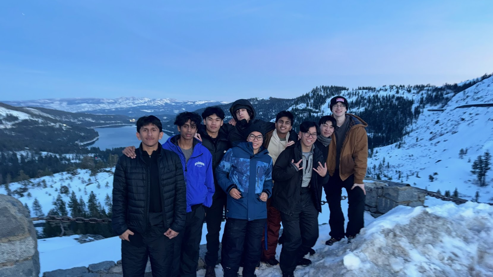
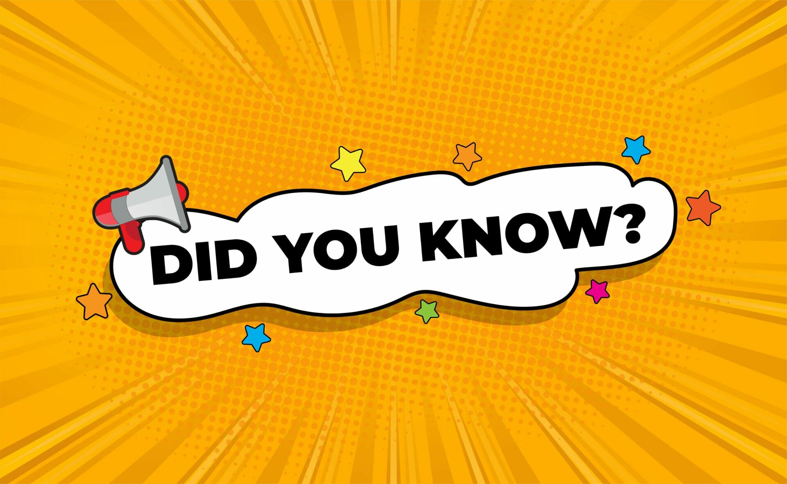

# User Page

## Jump to sections
[About me](#about-me)

[Programming skills](#programming-skills)

[Fun Facts](#fun-facts)

## About me

Hello! My name is Thanh-Long Nguyen-Trong, but most people call me <ins> T.L.</ins>. I am a second year CS student at Muir I am eager to learn more about software engineering practices. Above is a picture of my friends and I on ski trip (I am in blue quick silver jacket)

I've taken all CSE lower division courses and have taken a couple of CSE upper div courses, however I have never worked in a team as large as professor has described. I'm excited to work in a large team and learn about AGILE techniques

## Programming Skills

Currently, I am most proficient in the following languages:
* Python
* Java
* C
* C++

However, I would like to (re)learn about:

- [ ] Native web elements (HTML, CSS, and JS)
- [ ] Open source frameworks that emulate environments that we will see in the industry such as React
- [ ] How to collaborate effectively in a software team

## Fun Facts

One of my favorite quotes is:
> "Knowledge is power" - Sir Francis Bacon

My favorite line of code: `print("Hello world!")`

Current top animes (sorry for being basic, I don't have time to watch anymore):
1. Solo Leveling
2. Jujutsu Kaisen
3. Kaiju No. 8

This is a [picture](Pictures/Lebron.jpeg) to my favorite basketball player

This here is a link to my favorite [website](https://www.youtube.com/watch?v=xvFZjo5PgG0)!

[Back to top](#user-page)